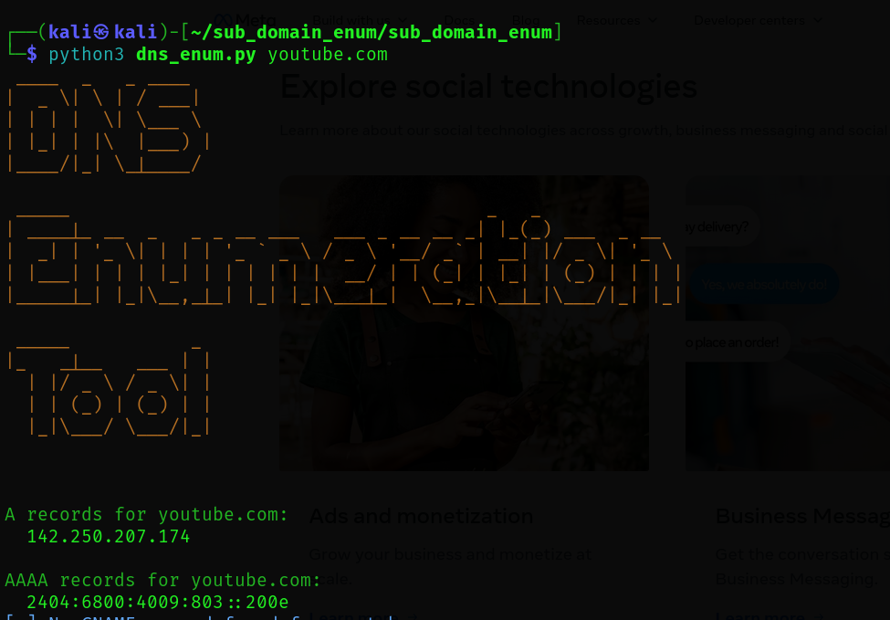
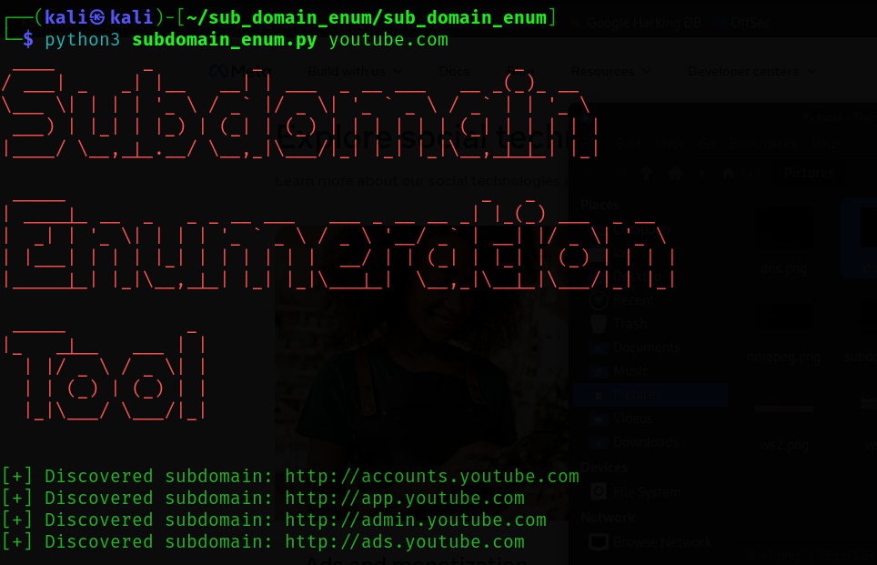

# sub_domain_enumeration
This Python project aims to discover subdomains of a target domain using wordlists and DNS queries. It helps identify hidden or vulnerable services by brute-forcing DNS names and checking for valid responses. Useful in penetration testing and reconnaissance phases.
# DNS-Enumeration 

The DNS Enumeration Tool is a Python-based utility designed to gather DNS-related information about a target domain. It performs DNS lookups to collect crucial data such as A, AAAA, MX, NS, and TXT records, which can reveal key infrastructure and mail server configurations. Built with modules like socket, dns.resolver, and colorama for terminal enhancements, this tool helps security professionals and bug bounty hunters in the initial phases of reconnaissance. It’s simple to use via the command line and is an excellent resource for understanding DNS protocols, response codes, and domain hierarchy. The tool emphasizes clarity and color-coded output for better readability of records. Whether you're learning about network enumeration or conducting a security assessment, this script provides foundational insights into how DNS works and how its misconfigurations can expose valuable information.

# Sub-Domain-Enumeration

The Subdomain Enumeration Tool is a Python script crafted to discover subdomains associated with a given domain name. It uses a brute-force technique, checking each possible subdomain against DNS records to identify which ones are valid and publicly accessible. The tool is customizable, allowing users to supply their own wordlists for enumeration, and includes multithreading support for faster execution. This makes it a practical choice for penetration testers, ethical hackers, and researchers looking to map a target's external attack surface. Subdomain enumeration is a key step in reconnaissance, as it often reveals forgotten or misconfigured services that can be exploited. This script demonstrates the importance of DNS hygiene and provides hands-on experience with concepts like DNS queries, threading, and automation in cybersecurity workflows. It’s lightweight, terminal-friendly, and easy to integrate into larger recon pipelines.
